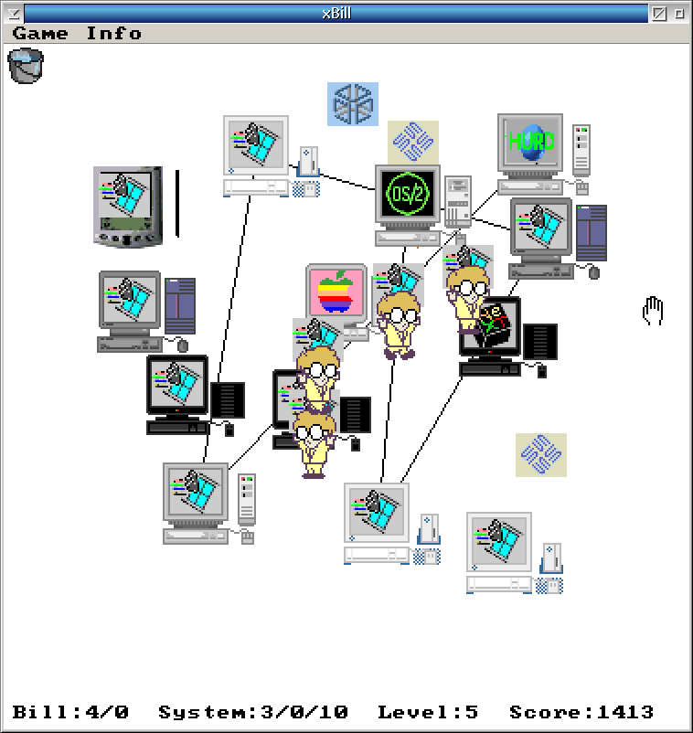

# xBill 2.1 — ArcaOS SDL2 Port

xBill is a classic Unix game where you play a system administrator defending
computers against an evil hacker named Bill who tries to infect them with
"Wingdows", a virus disguised as a popular operating system.

This is the SDL2 port of xBill 2.1 for ArcaOS (OS/2).



---

## Requirements

- ArcaOS 5.x (or eComStation / OS/2 Warp 4.52)
- SDL2 for OS/2 (`SDL2.DLL`)
- SDL2_image for OS/2 (`SDL2_image.DLL`)
- GCC/EMX toolchain (for building from source)

SDL2 and SDL2_image are available from the ArcaOS Software Subscription or
from Bitwise Works (https://www.bitwiseworks.com).

---

## Building from Source

Open an OS/2 command prompt in the project directory and run:

```
compile.cmd
```

This produces `bin\xbill.exe`. The build log is saved to `compile.cmd.log`.

### Build dependencies

- `gcc` (GCC/EMX)
- `make` (GNU make)
- `wl.exe` (OpenWatcom linker, used via EMXOMFLD)
- SDL2 development headers at `/@unixroot/usr/include/SDL2/`
- SDL2 and SDL2_image import libraries

---

## Running the Game

From the project directory:

```
bin\xbill.exe
```

The game window opens centered on the screen. No additional files need to be
copied — all graphics are embedded in the executable.

A high score file (`xbill.scores`) is written to the current directory.
Runtime error messages are written to `xbill_err.log` in the current directory.

---

## How to Play

You are a system administrator. Bills (the small running figures) will try to
reach your computers and install Wingdows. Keep them away.

| Action | How |
|---|---|
| Kill a Bill | Click on it |
| Restart an infected computer | Click on the computer |
| Recover a stolen OS | Drag the OS icon back to a compatible computer |
| Extinguish a network spark | Drag the bucket onto the spark |

The status bar at the bottom of the game area shows:

```
Bill: on-screen / off-screen   System: running / off / Wingdows   Level: N   Score: N
```

A level ends when all Bills are defeated. The next level starts automatically
after 2 seconds. The game ends when only one (or zero) computers remain
productive.

---

## Keyboard Shortcuts

| Key | Action |
|---|---|
| Ctrl+X | Quit immediately |
| Ctrl+P | Pause / resume (toggles PAUSED overlay) |
| Escape | Quit (with confirmation) |
| N | New game |
| W | Warp to level |
| H | View high scores |

---

## Menus

| Menu | Item | Description |
|---|---|---|
| Game | New Game | Start a new game from level 1 |
| Game | Warp to level... | Jump to a specific level |
| Game | View High Scores | Show the high score table |
| Game | Pause | Toggle pause (same as Ctrl+P) |
| Game | Quit Game | Quit with confirmation |
| Info | Story | Read the story |
| Info | Rules | Read the rules |
| Info | About | Version information |

---

## Technical Notes

- Window size: 750 × 772 pixels (750 × 750 game area + 22 px menu bar), centered on screen
- Game logic runs at the original 400 × 400 resolution, displayed at 2× scale
- All XPM and XBM graphics are embedded in the executable (no external image files needed)
- The SDL2 cursor API is not used on OS/2; the cursor is rendered in software
- Application icon embedded via OS/2 resource compiler (`src/xbill.rc` + `src/xbill.ico`)
- When paused, a semi-transparent PAUSED overlay is drawn over the game area
- Pausing via Ctrl+P or the Game menu does not interfere with the window-focus pause

---

## Original Authors

- **Brian Wellington** — main programmer
- **Matias Duarte** — programming and graphics (v2.0 and earlier)

## ArcaOS SDL2 Port

Ported to ArcaOS using SDL2. See `doc\changelog.txt` for the full history
of changes made during this port.
